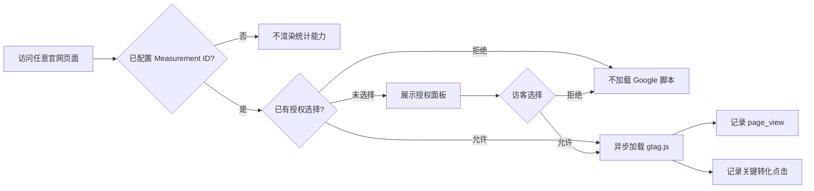

# 官网访问统计领域说明

## 业务背景

产品官网需要用真实访问与转化数据判断内容是否有效，但 Tandem 的品牌承诺是本地优先、隐私清晰。因此统计能力必须同时满足：

- 覆盖首页、对比页、法律页、Blog 列表和文章等全部使用 `Base.astro` 的页面；
- 访客明确同意前，不下载 Google Analytics 脚本，也不发送统计请求；
- 只统计页面访问与关键官网转化，不接触剪贴板、文件或 Tandem App 历史；
- 没有配置或配置错误时，行为可理解且不会静默产生错误数据。

## 领域概念

| 概念 | 规则 |
| --- | --- |
| Measurement ID | GA4 网站数据流 ID，格式为 `G-` 加字母数字 |
| 授权状态 | `granted`、`denied` 或未选择，保存在当前站点的 `localStorage` |
| 页面浏览 | Google tag 初始化后由 GA4 发送的默认 `page_view` |
| 关键转化 | Mac 下载、iPhone App Store、RSS 订阅三种稳定入口 |
| 统计设置 | 页脚入口，用于重新打开授权面板并撤回或重新授予授权 |

## 业务流程

## 关键实现

- `src/components/GoogleAnalytics.astro` 负责配置校验、授权面板、脚本延迟加载、撤回授权和转化事件。
- `src/layouts/Base.astro` 在所有页面内容之后统一挂载统计能力，子页面无需重复接入。
- `src/i18n/analytics.ts` 保存三语授权文案，避免与 App 内产品文案混用。
- `src/components/Footer.astro` 提供“统计设置”入口；未配置 Measurement ID 时入口保持隐藏。
- `src/i18n/legal.ts` 明确区分 App 数据实践与官网统计实践。

当前自定义事件：

| GA4 事件名 | 触发条件 |
| --- | --- |
| `mac_download_click` | 点击 `rambocode/tandem/releases` 下载入口 |
| `ios_app_store_click` | 点击 Apple App Store 入口 |
| `rss_subscribe` | 点击任一语言的 RSS 订阅入口 |

## 隐私与失败边界

- `PUBLIC_GOOGLE_ANALYTICS_ID` 为空时不显示授权面板、不加载脚本、也不显示统计设置入口。
- ID 不符合 GA4 `G-...` 格式时构建直接失败，避免上线后静默丢失数据。
- 拒绝授权时设置 GA 禁用标记；从已允许改为拒绝时，同时尽力删除当前域名的 `_ga` 第一方 Cookie。
- `localStorage` 不可用时授权仅对当前页面生效，下次页面访问会重新询问，不通过绕过存储限制来追踪访客。
- Google 脚本异步加载，网络失败不会阻塞页面内容、导航或下载入口。
- Blog 保持纯阅读；统计能力不会增加 Blog 评论或用户身份体系。

## 扩展规则

新增自定义事件前先回答“它会改变哪项产品决策”。事件名必须稳定、使用小写英文与下划线，不发送用户输入、文章正文、剪贴板内容、文件名或其他可能包含个人信息的数据。
