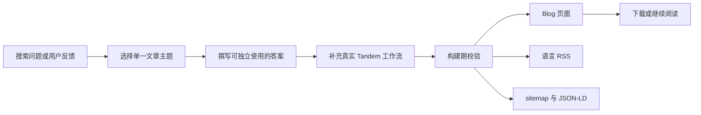

# Blog 与用户反馈领域说明

## 业务背景

官网需要两种长期能力：

- Blog 用实用内容承接搜索、软文推广和产品教育；
- 用户反馈让真实使用者公开表达需求，并为后续可核验的社会证明积累来源。

两者目标不同。Blog 是纯阅读内容，不开放文章评论；反馈入口只出现在官网首页，避免每篇文章重复产生审核和隐私负担。

## 领域概念

### 文章

文章存放在 `src/data/blog/<lang>/`，可以使用 `.md`、`.mdx` 或 `.html`。三种格式都使用 YAML frontmatter，并由 `src/content.config.ts` 在构建期校验。核心字段如下：

| 字段 | 规则 | 用途 |
| --- | --- | --- |
| `title` | 清晰回答一个搜索问题 | 页面标题、RSS、JSON-LD |
| `description` | 一到两句说明读者收益 | 搜索摘要、列表页 |
| `lang` | `en` / `zh` / `ja` | 路由与订阅源隔离 |
| `permalink` | 小写英文与连字符 | 稳定 URL，同一译文使用相同 permalink |
| `category` | 稳定内容主题 | 列表页标签 |
| `publishedAt` | ISO 日期 | 排序与搜索语义 |
| `updatedAt` | 可选 | 实质更新后填写 |
| `readingMinutes` | 正整数 | 阅读预期 |
| `featured` | 每种语言最多一篇 | Blog 首页主文章 |
| `draft` | 草稿设为 `true` | 不进入页面、RSS、sitemap |
| `format` | 自动生成，无需手填 | 区分 Markdown 与 HTML 渲染来源 |

HTML 文件只允许文章正文标记。构建会拒绝 `script`、`iframe`、`object`、`embed`、`form`、内联事件属性和 `javascript:` URL；一级到六级标题会自动补稳定 `id`，因此文章目录与 Markdown 保持一致。

### 用户反馈

首页反馈使用 utterances，把访问路径映射到 `rambocode/tandem` 的 GitHub Issue。反馈必须满足：

- 不预置虚构头像、评分、评价或使用数字；
- 公开说明反馈存放位置与 GitHub 登录要求；
- 仓库维护者通过 GitHub 的权限、锁定和删除能力审核内容；
- 未完成外部应用授权时展示正常的“准备中”状态，不加载失败的第三方 iframe。

## 业务流程

## 关键实现

- `src/components/BlogIndex.astro` 负责杂志式列表，不把文章做成同质卡片墙。
- `src/components/BlogPost.astro` 负责文章语义、目录、相关推荐和 `BlogPosting` 结构化数据，不包含评论组件。
- `src/loaders/html-blog.ts` 读取带 frontmatter 的 HTML，执行安全边界校验并提取目录。
- `src/lib/blog.ts` 合并 Markdown/MDX 与 HTML collection，统一草稿过滤、排序、路径和日期格式，避免 RSS 与页面产生不同结果。
- `/rss.xml`、`/zh/rss.xml`、`/ja/rss.xml` 各自只输出一种语言。
- `src/pages/sitemap.xml.ts` 从真实路由与已发布文章生成站点地图，新增文章无需维护静态 XML。
- `src/components/CommunityFeedback.astro` 是唯一反馈入口；`Comments.astro` 负责授权前后的降级。

## 启用真实反馈

1. 在 `rambocode/tandem` 仓库安装 utterances GitHub App，并只授权需要的仓库；
2. 确认仓库 Issues 可供反馈写入；
3. 在部署环境设置 `PUBLIC_UTTERANCES_ENABLED=true`；
4. 部署后使用非维护者 GitHub 账号完成一次登录与提交验收；
5. 检查 Issue 标签 `website-comment`、删除、锁定和通知流程。

安装 GitHub App 属于外部权限变更，必须由仓库所有者明确授权后执行。未启用时，网站仍可完整构建，反馈区只展示说明与 GitHub 入口。

## 隐私与失败边界

- Blog 页面不加载评论脚本。
- 首页仅在启用反馈后加载 `utteranc.es` iframe；访问者将与 GitHub/utterances 建立网络连接。
- GitHub 登录失败、App 被撤销或 Issues 不可写时，不能吞掉错误；应关闭环境开关，回到可理解的准备中状态。
- 官网产品的“无云端”描述指 Tandem 的设备内容传输；网站反馈会公开存放在 GitHub，页面必须明确区分。
